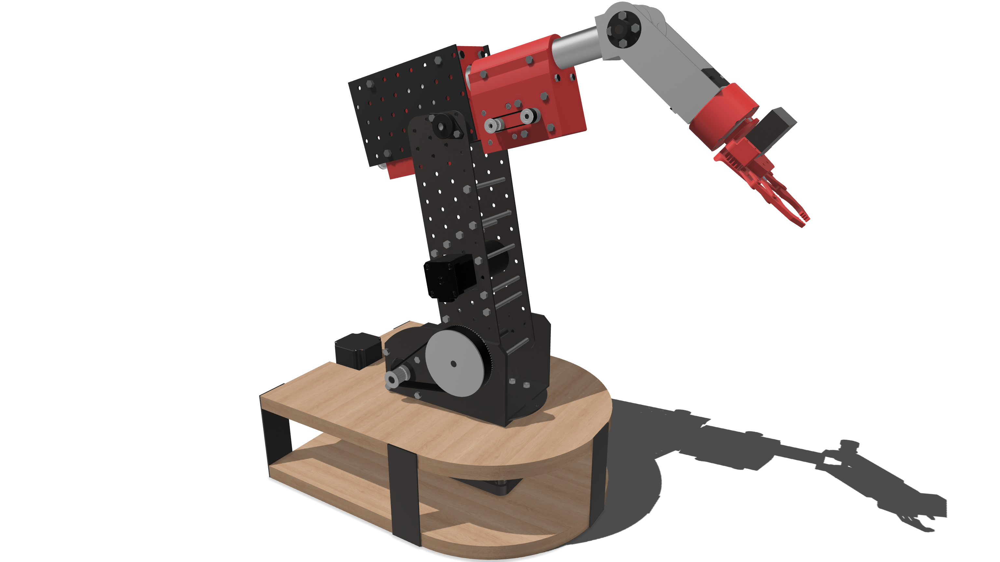
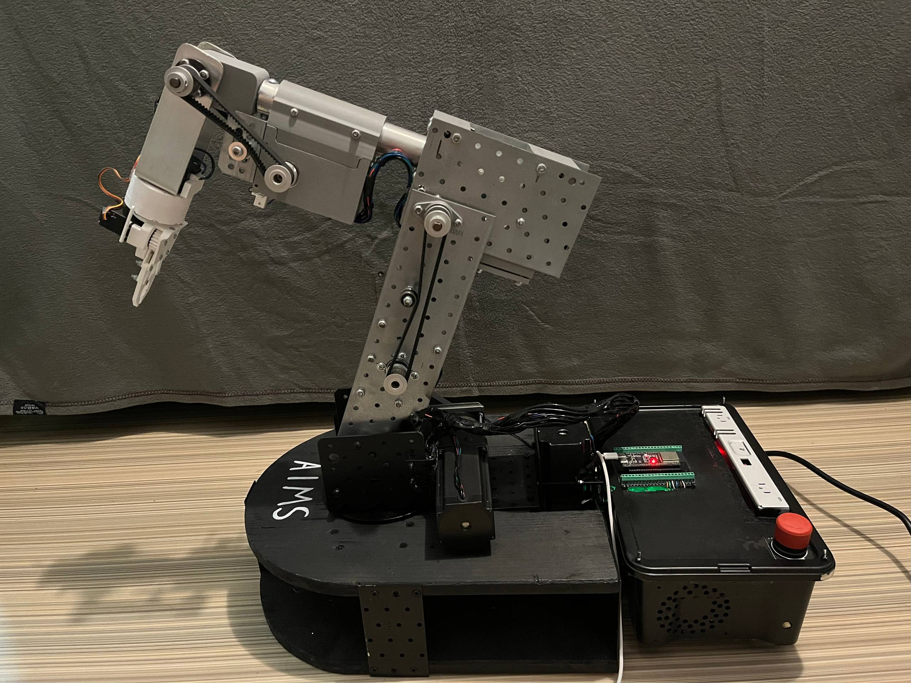

# AIMS: Articulated Intelligent Manipulation System
> **A low-cost, six-degree-of-freedom (6-DoF) robotic manipulator with fully integrated Cartesian control.**

  
  

---

## Key Features

*   **Standalone Operation:** The system runs entirely on an **ESP32-S3** microcontroller. It handles inverse kinematics, motion planning, calibration, and teach-and-repeat functionality without requiring an external computer.
*   **Wireless Web Interface:** Enables intuitive, wireless control of the robot directly from any web browser.
*   **Computer Vision Integration:** A separate vision module powered by OpenCV and YOLO performs real-time object detection and workspace mapping.
*   **High Resolution, Low Cost:** Built using stepper motors, belt transmissions, and planetary gear reductions to maximize precision while keeping hardware costs down.
*   **Advanced Kinematics:** Utilizes a real-angle joint model to simplify kinematics, paired with gravity-induced deformation compensation to significantly improve accuracy under load.

## Performance & Capabilities

*   **Repeatability:** Sub-millimeter accuracy.
*   **Workspace Range:** Approximately 750 mm.
*   **Applications:** Highly efficient vision-guided manipulation and automated tasks.

##  Bill of Materials (BOM)

| Component | Qty | Usage | Source / Link |
| :--- | :---: | :--- | :---: |
| Nema 23 Stepper Motor (2.5 Nm) | 1 | Joint 1 | [Link](https://www.aliexpress.com/item/1005008345392251.html?spm=a2g0o.order_list.order_list_main.87.96b218026ZKrhr) |
| Nema 23 Stepper Motor (3.0 Nm) | 1 | Joint 2 | [Link](https://www.aliexpress.com/item/1005008357901354.html?spm=a2g0o.order_list.order_list_main.92.96b218026ZKrhr) |
| Planetary Gearbox 1:10 (Nema 23) | 1 | Joint 1 | [Link](https://www.aliexpress.com/item/1005008463841789.html?spm=a2g0o.order_list.order_list_main.78.96b218026ZKrhr) |
| Nema 17 Stepper Motor (0.7 Nm) | 2 | Joint 3 | [Link](https://www.aliexpress.com/item/1005010354201440.html?spm=a2g0o.order_list.order_list_main.77.96b218026ZKrhr) |
| Planetary Gearbox 1:20 (Nema 17) | 2 | Joint 3, Joint 5 | [Link](https://www.aliexpress.com/item/1005010354201440.html?spm=a2g0o.order_list.order_list_main.77.96b218026ZKrhr) |
| Nema 17 Stepper Motor (0.45 Nm) | 1 | Joint 5 | [Link](https://www.aliexpress.com/item/1005007293709095.html?spm=a2g0o.order_list.order_list_main.10.96b218026ZKrhr) |
| Nema 17 Stepper Motor Short/Pancake (0.16 Nm) | 1 | Joint 6 | [Link](https://www.aliexpress.com/item/1005006722496911.html?spm=a2g0o.order_list.order_list_main.112.96b218026ZKrhr) |
| Planetary Gearbox (Nema 17) | 1 | Joint 6 | [3D Printed](https://github.com/AndrewC3870/AIMS-Articulated-Intelligent-Manipulation-System/blob/e1582351b9eff7f9d4ed971e265c47a4c45c2014/step-files/PlanetaryGearbox.step) |
| 36V 400W Power Supply | 1 | Robot Power Supply | [Link](https://www.aliexpress.com/item/1005008204035607.html?spm=a2g0o.order_list.order_list_main.88.96b218026ZKrhr) |
| LM2596 DC-DC Step-Down Converter | 1 | ESP + Logic Shifters Power Supply | [Link](https://www.aliexpress.com/item/1005009448899169.html?spm=a2g0o.order_list.order_list_main.102.96b218026ZKrhr) |
| TXS0108E 3.3V to 5V Logic Level Shifter | 2 | ESP to Driver | [Link](https://www.optimusdigital.ro/ro/interfata-convertoare-de-niveluri/1380-convertor-de-niveluri-logice-bidirecional-pe-8-bii-txs0108e.html?search_query=TXS0108E&results=1) |
| DM556 Stepper Driver | 2 | Driver Nema 23 | [Link](https://www.aliexpress.com/item/1005008804993379.html?spm=a2g0o.order_list.order_list_main.123.96b218026ZKrhr) |
| DM542 Stepper Driver | 4 | Driver Nema 17 | [Link](https://www.aliexpress.com/item/1005007342364459.html?spm=a2g0o.order_list.order_list_main.117.96b218026ZKrhr) |
| ESP32-S3 WROOM | 1 | Brain | [Link](https://www.aliexpress.com/item/1005008957932920.html?spm=a2g0o.order_list.order_list_main.107.96b218026ZKrhr) |
| ESP32-S3 Development Board | 1 | For easy wiring | [Link](https://www.aliexpress.com/item/1005008957932920.html?spm=a2g0o.order_list.order_list_main.107.96b218026ZKrhr) |
| HTD 3M Timing Pulley (20 Teeth) | 5 | Torque transmission M3-J3, M5-J5 | [Link](https://www.aliexpress.com/item/1005008441306459.html?spm=a2g0o.order_list.order_list_main.5.96b218026ZKrhrhttps://www.aliexpress.com/item/1005008441306459.html?spm=a2g0o.order_list.order_list_main.5.96b218026ZKrhr) |
| HTD 3M Timing Pulley (15 Teeth) | 2 | Torque transmission M4-J4 | [Link](https://www.aliexpress.com/item/1005008441306459.html?spm=a2g0o.order_list.order_list_main.5.96b218026ZKrhrhttps://www.aliexpress.com/item/1005008441306459.html?spm=a2g0o.order_list.order_list_main.5.96b218026ZKrhr) |
| HTD 3M Timing Pulley (80 Teeth) | 1 | Torque transmission M2-J2 | [Link](https://www.aliexpress.com/item/1005007835192076.html?spm=a2g0o.order_list.order_list_main.15.96b218026ZKrhr) |
| HTD 3M Timing Pulley (150 Teeth) | 1 | Torque transmission M1-J1 | [3D Printed](https://github.com/AndrewC3870/AIMS-Articulated-Intelligent-Manipulation-System/blob/e1582351b9eff7f9d4ed971e265c47a4c45c2014/step-files/Pulley.step) |
| HTD 3M Timing Belts (276, 357, 390, 681) | 4 | Torque transmission (1 of each) | [Link](https://www.aliexpress.com/item/1005008698694885.html?spm=a2g0o.order_list.order_list_main.25.96b218026ZKrhr) |
| GT2 Pulley (20 Teeth) | 2 | Motor to gearbox torque transmission J5 | [Link](https://www.aliexpress.com/item/1005008698694885.html?spm=a2g0o.order_list.order_list_main.25.96b218026ZKrhr) |
| GT2 Belt (124mm) | 1 | Motor to gearbox torque transmission J5 | [Link](https://www.aliexpress.com/item/1005008878754443.html?spm=a2g0o.order_list.order_list_main.40.96b218026ZKrhr) |
| Micro Limit Switch (SPDT) | 6 | Homing | [Link](https://www.aliexpress.com/item/1005008226608212.html?spm=a2g0o.order_list.order_list_main.20.96b218026ZKrhr) |
| KLF 08 Shaft Support / Coupler | 6 | Assembly | [Link](https://www.aliexpress.com/item/1005005167837896.html?spm=a2g0o.order_list.order_list_main.61.96b218026ZKrhr) |
| Flange | 6 | Assembly | [Link](https://www.aliexpress.com/item/1005009915654076.html?spm=a2g0o.order_list.order_list_main.51.96b218026ZKrhr) |
| Emergency Stop Button | 1 | Emergency stop | [Link](https://www.dedeman.ro/ro/buton-ciuperca-cu-retinere-freder-d40-32-765-contact-normal-inchis-ip40/p/1032603) |
| Aluminum Pipe (30x2x300mm) | 1 | Joint 4 Structure | [Link](https://www.emag.ro/teava-aluminiu-rotunda-30x2mm-lungime-40cm-gal-industrial-rurok-stnd-al-30x2-x40/pd/DPVCXRYBM/?ref=graph_profiled_similar_fallback_1_2&provider=rec&recid=rec_49_ac710b5573be5e74fef67bae5d36035dc50c9bffdc9260f085faf384352c4fd0_1779562289&scenario_ID=49) |
| CAT5e Wire | 1 | Wiring for data | [Link](https://www.bricodepot.ro/cablu-retea-utp-cat5e-omnicable-alb-metru/cpd/100866006/) |
| 2.5mm² Wire | 1 | Wiring for power | [Link](https://www.bricodepot.ro/cablu-electric-omnicable-myym-4-x-2-5mm2-alb-metru/cpd/100866026/) |
| Bolts and Nuts | A lot | Assembly | Brico |
